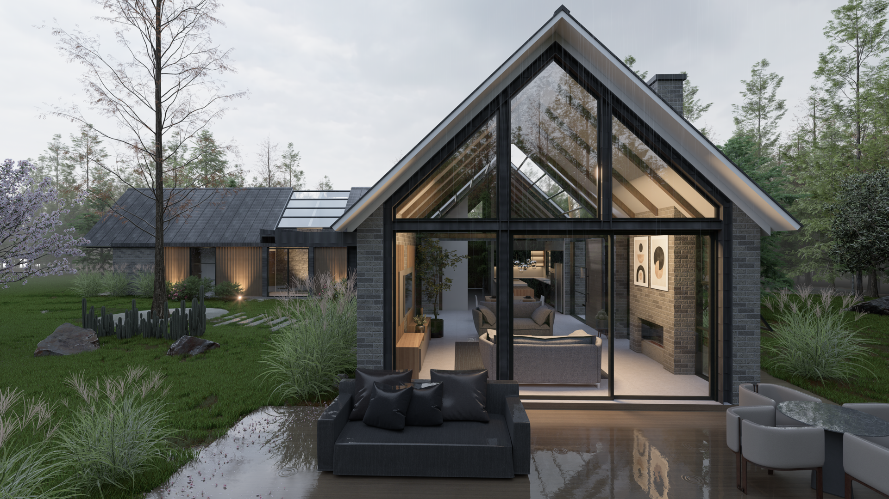
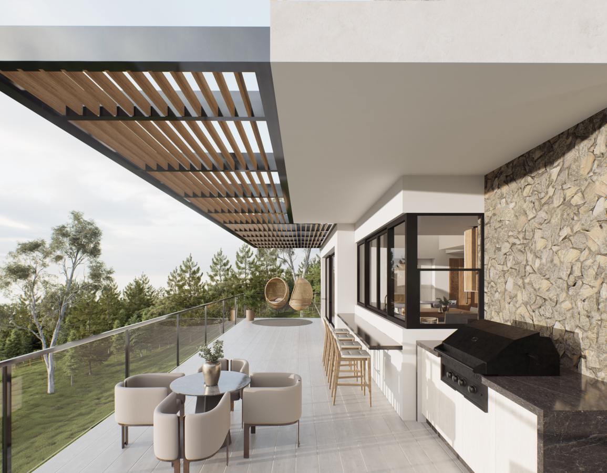
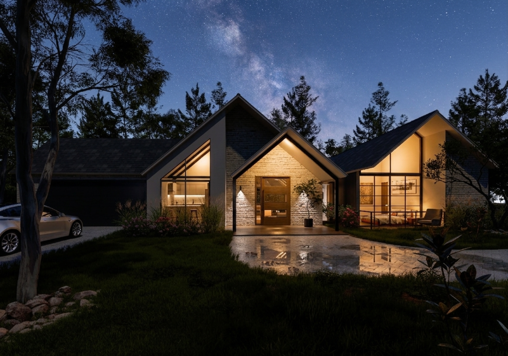
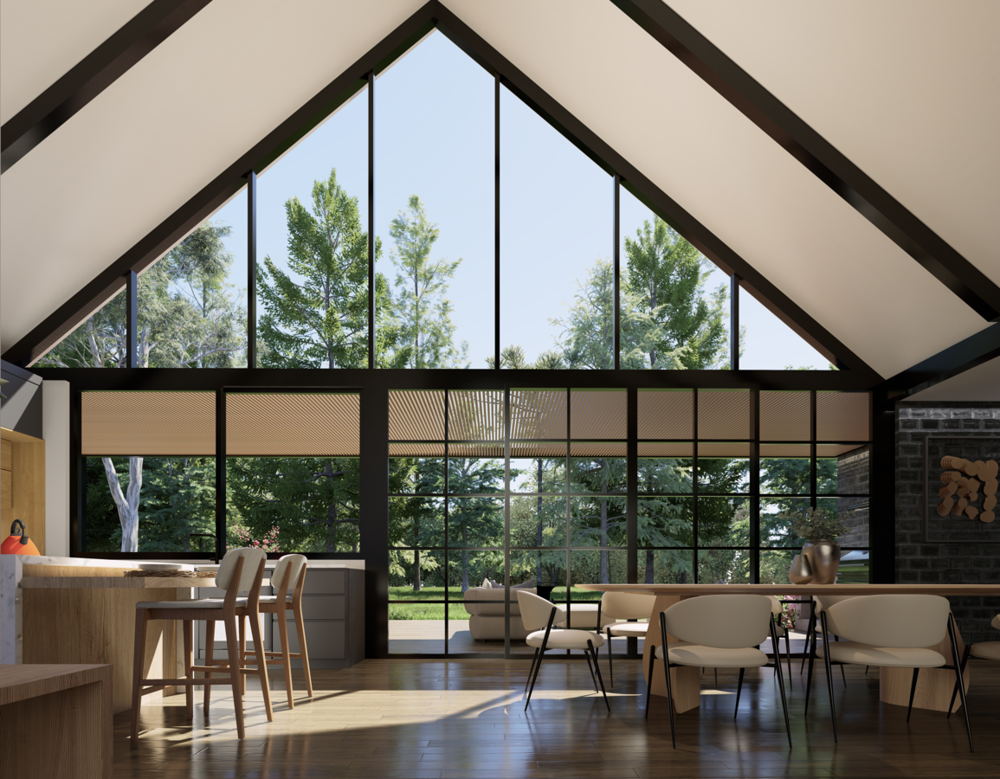
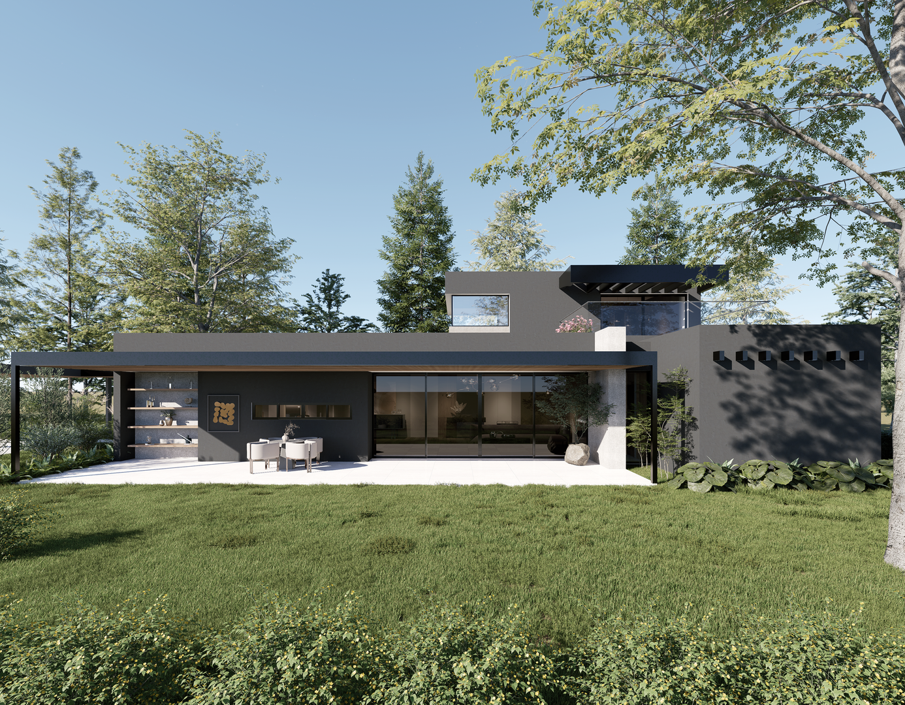
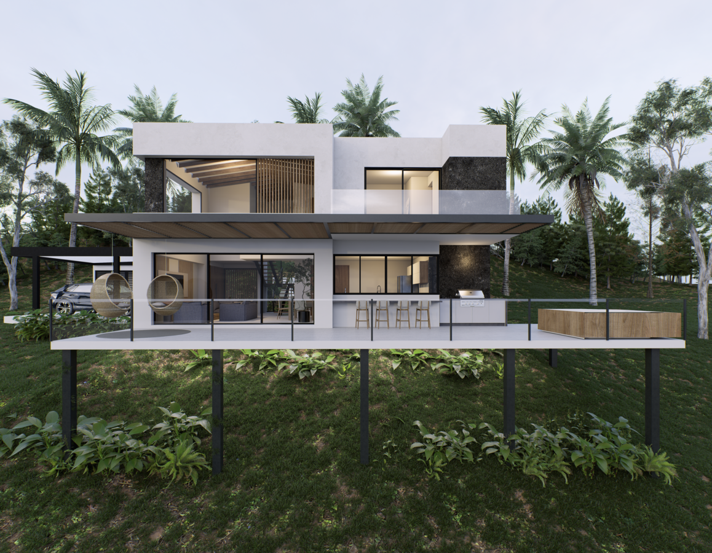
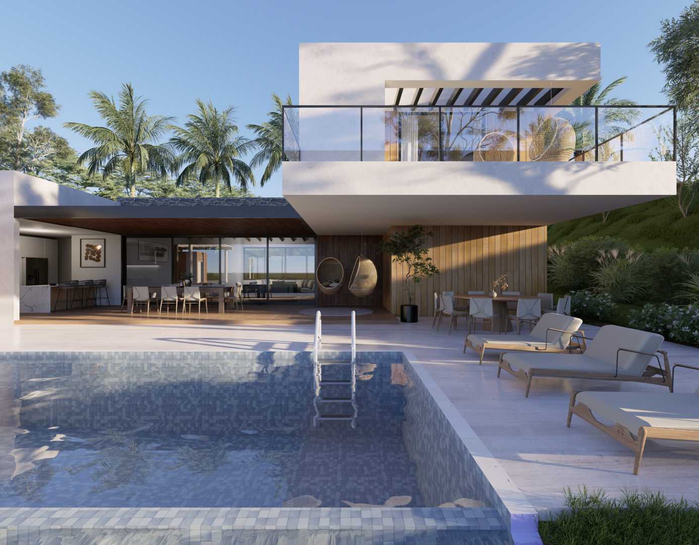
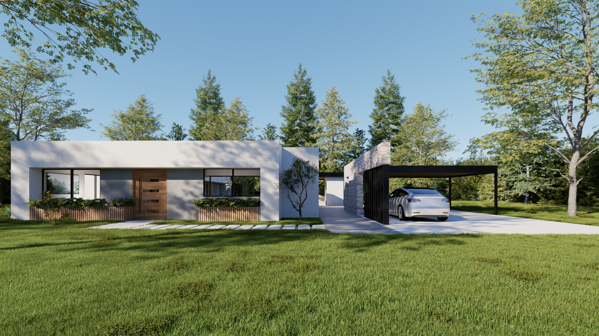
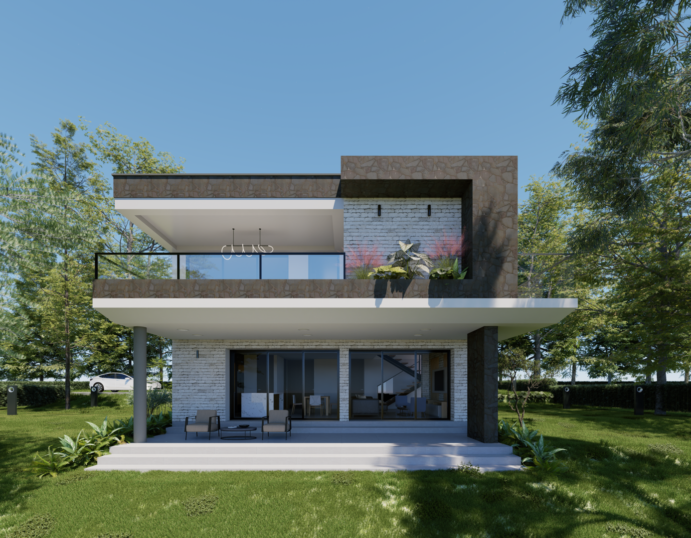

# 📁 ESTRUCTURA DE CARPETAS - EA ESPACIOS ARQUITECTÓNICOS

## Estructura Completa Necesaria

```
tu-proyecto/
│
├── index.html
├── proyectos.html
├── planos.html
├── blog.html
├── README.md
│
└── images/
    │
    ├── logo.png (o logo.svg)
    │
    ├── Casa-de-verano-01.png
    ├── Casa-de-verano-04.png
    │
    ├── Casa-en-el-bosque-01.png
    ├── Casa-en-el-bosque-02.png
    ├── Casa-en-el-bosque-03.png
    ├── Casa-en-el-bosque-04.png
    ├── Casa-en-el-bosque-05.png
    ├── Casa-en-el-bosque-06.png
    │
    ├── Casa-en-la-ladera-01.png
    ├── Casa-en-la-ladera-02.png
    ├── Casa-en-la-ladera-03.png
    ├── Casa-en-la-ladera-04.png
    ├── Casa-en-la-ladera-05.png
    │
    ├── Casa-el-refugio-01.png
    ├── Casa-el-refugio-02.png
    ├── Casa-el-refugio-03.png
    ├── Casa-el-refugio-04.png
    ├── Casa-el-refugio-05.png
    ├── Casa-el-refugio-06.png
    ├── Casa-el-refugio-07.png
    ├── Casa-el-refugio-08.png
    │
    ├── Casa-San-Cristobal-01.png
    ├── Casa-San-Cristobal-02.png
    ├── Casa-San-Cristobal-03.png
    ├── Casa-San-Cristobal-04.jpeg
    │
    ├── Casa-SP-01.png
    ├── Casa-SP-02.png
    ├── Casa-SP-03.png
    ├── Casa-SP-04.png
    ├── Casa-SP-05.png
    ├── Casa-SP-06.png
    │
    ├── Casa-JT-01.png
    ├── Casa-JT-01A.png
    ├── Casa-JT-02.png
    ├── Casa-JT-02A.png
    ├── Casa-JT-03.png
    ├── Casa-JT-03A.png
    ├── Casa-JT-04.png
    ├── Casa-JT-05.png
    │
    ├── Casa-MT-01.png
    ├── Casa-MT-02.png
    ├── Casa-MT-03.png
    ├── Casa-MT-04.png
    ├── Casa-MT-05.png
    │
    └── videos/
        └── Video-transicion-de-dia-a-noche.mp4
```

---

## 📋 Resumen de Archivos Necesarios

### HTML (4 archivos)
- ✅ `index.html` - Página de inicio (ACTUALIZADO)
- ✅ `proyectos.html` - Galería de proyectos (ACTUALIZADO)
- ✅ `planos.html` - Catálogo de planos
- ✅ `blog.html` - Portal de blog

### Imágenes (50 archivos)
```
Casa-de-verano: 2 imágenes
Casa-en-el-bosque: 6 imágenes
Casa-en-la-ladera: 5 imágenes
Casa-el-refugio: 8 imágenes
Casa-San-Cristobal: 4 imágenes (1 JPEG)
Casa-SP: 6 imágenes
Casa-JT: 8 imágenes
Casa-MT: 5 imágenes
Logo: 1 imagen
TOTAL: 45 imágenes + 1 logo = 46 archivos de imagen
```

### Video (1 archivo)
```
Video-transicion-de-dia-a-noche.mp4
```

---

## 🎯 Cómo Organizar Localmente

### Paso 1: Crea la carpeta base
```bash
mkdir mi-proyecto-ea
cd mi-proyecto-ea
```

### Paso 2: Copia los archivos HTML
Coloca los 4 archivos HTML en la raíz de la carpeta:
- index.html
- proyectos.html
- planos.html
- blog.html
- README.md

### Paso 3: Crea carpeta de imágenes
```bash
mkdir images
mkdir images/videos
```

### Paso 4: Descarga las imágenes de Google Drive
1. Abre tu carpeta de Google Drive
2. Selecciona todas las imágenes
3. Descarga como ZIP
4. Descomprime en la carpeta `images/`
5. Asegúrate que el video esté en `images/videos/`

### Paso 5: Verifica estructura
```bash
tree mi-proyecto-ea/
# Deberías ver:
# mi-proyecto-ea/
# ├── index.html
# ├── proyectos.html
# ├── planos.html
# ├── blog.html
# ├── README.md
# └── images/
#     ├── Casa-*.png
#     ├── logo.png
#     └── videos/
#         └── Video-transicion-de-dia-a-noche.mp4
```

---

## 🔗 Referencias en el Código HTML

### ✅ En index.html
```html
<!-- Hero Carousel (7 imágenes) -->








<!-- Video en About Section -->
<video autoplay muted loop>
  <source src="./images/videos/Video-transicion-de-dia-a-noche.mp4" type="video/mp4">
</video>
```

### ✅ En proyectos.html
```html
<!-- Cada proyecto apunta a sus imágenes específicas -->

<!-- Casa en la Ladera (1 principal + 5 en galería) -->

<!-- Modal con: 01, 02, 03, 04, 05 -->

<!-- Casa SP (1 principal + 6 en galería) -->

<!-- Modal con: 01, 02, 03, 04, 05, 06 -->

<!-- Casa El Refugio (1 principal + 8 en galería) -->

<!-- Modal con: 01, 02, 03, 04, 05, 06, 07, 08 -->

<!-- Casa San Cristóbal (1 principal + 4 en galería) -->

<!-- Modal con: 01, 02, 03, 04.jpeg -->

<!-- Casa MT (1 principal + 5 en galería) -->

<!-- Modal con: 01, 02, 03, 04, 05 -->

<!-- Casa JT (1 principal + 8 en galería) -->

<!-- Modal con: 01, 01A, 02, 02A, 03, 03A, 04, 05 -->
```

---

## ⚠️ Notas Importantes

### Nombres de Archivos
- ✅ Los nombres de archivos **DEBEN ser exactamente iguales**
- ✅ Respeta mayúsculas/minúsculas
- ✅ Respeta guiones y números
- ❌ NO cambies "Casa-en-la-ladera" a "Casa-En-La-Ladera"

### Formatos Aceptados
- ✅ PNG (recomendado para fotos)
- ✅ JPG/JPEG (también funciona)
- ✅ WebP (para mejor rendimiento)
- ✅ MP4 (para video)

### Rutas Relativas
- `./images/Casa-SP-01.png` ✅ CORRECTO (punto significa carpeta actual)
- `images/Casa-SP-01.png` ✅ TAMBIÉN FUNCIONA
- `/images/Casa-SP-01.png` ❌ NO EN VERCEL (barra absoluta)
- `https://...` ❌ No es ruta local

---

## 🚀 Próximos Pasos

1. **Organiza las carpetas** según esta estructura
2. **Descarga las imágenes** de Google Drive
3. **Coloca los HTMLs** en la raíz
4. **Sube TODO a GitHub** (el repositorio)
5. **Deploy en Vercel** (conecta el repositorio)
6. **¡Listo!** Tu sitio está en vivo

---

## 📦 Para Subir a GitHub

```bash
# En la carpeta del proyecto
git init
git add .
git commit -m "EA Espacios Arquitectónicos - Portal web completo"
git branch -M main
git remote add origin https://github.com/tu-usuario/espaciosarquitectonicos-web.git
git push -u origin main
```

---

## 🎨 Optimizaciones Opcionales

Para reducir peso de archivos (recomendado para producción):

1. **Comprimir imágenes:**
   - Usa TinyPNG.com (gratuito, buena calidad)
   - O ImageOptim (Mac) / OptiPNG (Windows)

2. **Convertir a WebP:**
   - Mejor compresión que PNG/JPG
   - Soportado en navegadores modernos

3. **Video:**
   - Asegúrate que esté en MP4 H.264
   - Tamaño recomendado: < 50MB

---

## ❓ Preguntas Comunes

**P: ¿Qué pasa si me falta una imagen?**
R: Verás un icono de imagen rota. Descarga la imagen que falta de Drive.

**P: ¿Puedo reorganizar las carpetas?**
R: No, debes mantener la estructura exacta como se muestra arriba.

**P: ¿Qué tamaño deben tener las imágenes?**
R: 1200x800px o mayor (Vercel las optimiza automáticamente).

**P: ¿El video está en bucle?**
R: Sí, en index.html tiene `loop autoplay muted`.

---

**Fecha:** 21 de Mayo, 2026
**Estado:** Listo para producción
**Próximo paso:** Organizar carpetas y subir a GitHub/Vercel
